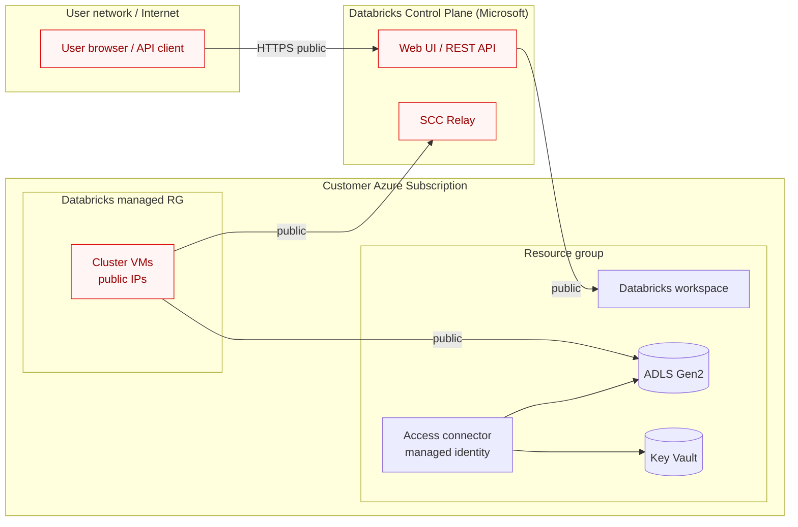
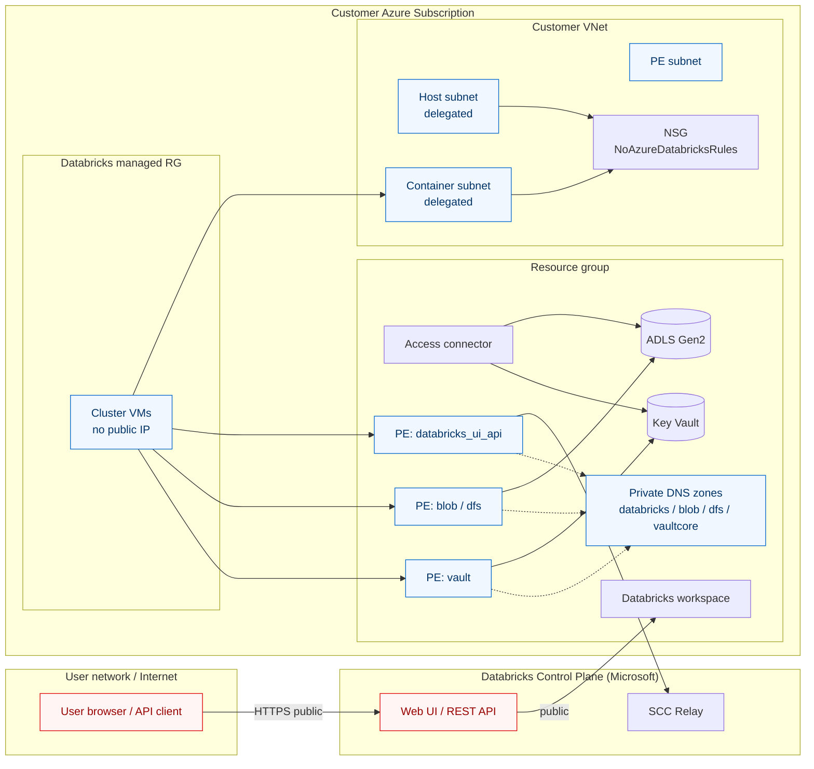
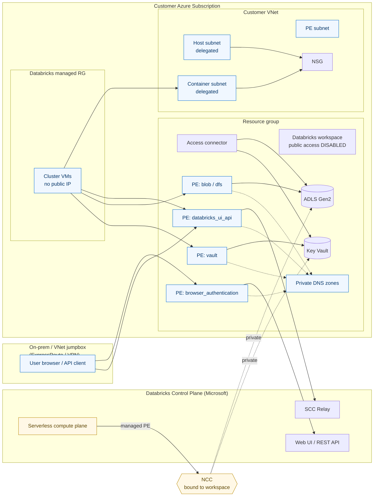

# Azure Databricks Deployment Accelerator

<p align="left">
  
  
  
</p>

> **First attempt — work in progress.** This repository is an early experiment
> at converting an existing, Azure Databricks Terraform
> codebase I worked on, into a reusable
> accelerator that anyone can drop into their own Azure environment. **Caution**: Expect
> rough edges. Issues and PRs are very welcome.

A `make`-driven Terraform accelerator that stands up an Azure Databricks
workspace in one of three well-defined network connectivity patterns:

1. **Barebone (public)** — quickest path to a working workspace, all public
   connectivity.
2. **Backend private connectivity only** — VNet-injected workspace with Secure
   Cluster Connectivity over a private endpoint; the frontend (UI / REST) is
   still reachable over the internet.
3. **Frontend + backend private connectivity, with NCC for serverless** — fully
   private workspace plus a Network Connectivity Configuration so serverless
   compute (jobs, SQL warehouses, model serving) can reach storage and Key
   Vault over Databricks-managed private endpoints.

***

## Background

This repo started life as the IaC for one specific Azure Databricks platform.
The structure (root segregation between `infra`, `databricks`, and
`role-assignments`, plus the reusable modules under `modules/`) was solid, but
the configuration baked in a lot of project-specific assumptions: hardcoded
naming conventions, fixed group names, mandatory shared services (ACR, shared
DNS zones, Log Analytics), and a single connectivity topology.

The goal of this accelerator is to keep that proven structure but make the
roots **generic and parameter-driven**, so the same code can produce any of the
three common Databricks network topologies described by Microsoft's
[Databricks network security guidance](https://learn.microsoft.com/en-us/azure/databricks/security/network/).

Several things were intentionally trimmed:

* No mandatory shared ACR / Log Analytics / DNS zones.
* No Azure DevOps pipeline yet — only the makefile.
* Local Terraform state by default (so you can run it in five minutes without
  bootstrapping a backend storage account).
* Unity Catalog assets, secret scopes, instance pools, and cluster definitions
  are out of scope for now — the focus is on getting the workspace + network
  topology right.

These are deliberate trade-offs to keep the first iteration small. Expanding
the `databricks` and `role-assignments` roots back out is on the roadmap.

***

## Connectivity patterns at a glance

| # | Pattern                         | `connectivity_pattern` | Frontend (UI / REST)                        | Backend (SCC)                                                         | NCC for serverless                | Typical use                                                            |
| - | ------------------------------- | ---------------------- | ------------------------------------------- | --------------------------------------------------------------------- | --------------------------------- | ---------------------------------------------------------------------- |
| 1 | Barebone (public)               | `public`               | Public                                      | Public over Azure backbone                                            | No                                | Demos, learning, non-sensitive workloads                               |
| 2 | Backend private link only       | `backend-private`      | Public                                      | Private endpoint (`databricks_ui_api`) + `NoAzureDatabricksRules` NSG | No                                | Production with VNet injection, users still reach UI from the internet |
| 3 | Frontend + backend private link | `full-private`         | Private endpoint (`browser_authentication`) | Private endpoint (`databricks_ui_api`)                                | **Yes** — NCC + workspace binding | Regulated workloads, no internet exposure                              |

What the `infra` root provisions per pattern:

| Resource                                                    | `public` | `backend-private` | `full-private`                            |
| ----------------------------------------------------------- | -------- | ----------------- | ----------------------------------------- |
| Resource group                                              | ✓        | ✓                 | ✓                                         |
| VNet + delegated subnets (host/container) + PE subnet + NSG | –        | ✓                 | ✓                                         |
| ADLS Gen2 storage account                                   | ✓        | ✓                 | ✓                                         |
| Key Vault (RBAC mode)                                       | ✓        | ✓                 | ✓                                         |
| Databricks workspace                                        | ✓        | ✓ (VNet injected) | ✓ (VNet injected, public access disabled) |
| Databricks access connector (managed identity)              | ✓        | ✓                 | ✓                                         |
| Storage / Key Vault private endpoints + DNS zones           | –        | ✓                 | ✓                                         |
| Workspace `databricks_ui_api` private endpoint              | –        | ✓                 | ✓                                         |
| Workspace `browser_authentication` private endpoint         | –        | –                 | ✓                                         |
| `privatelink.azuredatabricks.net` DNS zone                  | –        | ✓                 | ✓                                         |

The `databricks` root only materialises an **NCC (Network Connectivity
Configuration)** and binds it to the workspace — and only when the active
pattern is `full-private`. It is a no-op for the other patterns, which keeps
the workflow identical across all three.

The `role-assignments` root assigns Databricks workspace USER / ADMIN
permissions to AAD groups (referenced by object ID or display name).

***

## Architecture

The diagrams below show the network topology each pattern produces. They focus
on connectivity — the storage account, Key Vault, access connector, and
managed-identity wiring exist in every pattern and are only highlighted where
they materially change between patterns.

### Pattern 1 — Barebone (public)

No VNet injection. The Databricks data plane lives in a Microsoft-managed
network and reaches the control plane and storage entirely over the public
internet (Azure backbone). Cheapest and fastest to deploy; not suitable for
regulated workloads.



### Pattern 2 — Backend private connectivity only

Workspace is **VNet-injected**, with the data plane locked into customer
subnets (Secure Cluster Connectivity, no public IPs). All data-plane to
control-plane traffic is forced over the `databricks_ui_api` private
endpoint. Storage and Key Vault are reached over private endpoints.
The web UI / REST API frontend remains public, so users continue to log in
over the internet.



### Pattern 3 — Frontend + backend private connectivity (with NCC)

Workspace public network access is **disabled**. Both the frontend
(`browser_authentication`) and backend (`databricks_ui_api`) flow through
private endpoints in the customer VNet, so users must connect from on-prem
(ExpressRoute / VPN) or a jumpbox inside the VNet. A **Network Connectivity
Configuration (NCC)** is created and bound to the workspace so serverless
compute (jobs, SQL warehouses, model serving) reaches storage and Key Vault
over Databricks-managed private endpoints — no public egress required.



> Note: GitHub renders Mermaid diagrams natively in Markdown previews. If you
> are reading this in an editor that does not support Mermaid, view the file
> on GitHub or install a Mermaid preview extension.

***

## Repository layout

```text
.
├── makefile                                  # main entry point — see `make help`
├── modules/                                  # reusable building blocks (Terraform modules)
│   ├── azure-core/
│   │   └── resource-group/
│   ├── azure-governance/
│   │   ├── role-assignment/
│   │   ├── resource-lock/
│   │   └── security-group-association/
│   ├── azure-networking/
│   │   ├── databricks-vnet/                  # VNet + delegated subnets + PE subnet + NSG
│   │   ├── private-dns-zone/
│   │   ├── private-endpoint/
│   │   └── …
│   ├── azure-security/
│   │   ├── key-vault/
│   │   └── …
│   └── data-foundation/
│       ├── azure-databricks/                 # Databricks workspace + access connector
│       ├── storage-account/
│       └── databricks-assets/
│           └── ncc/                          # NCC for serverless private connectivity
└── terraform/
    ├── code/                                 # Terraform roots (one per lifecycle phase)
    │   ├── infra/                            # parameterised — handles all 3 patterns
    │   ├── databricks/                       # NCC (only created for full-private)
    │   └── role-assignments/                 # workspace permissions
    └── env/                                  # per-environment, per-pattern inputs
        ├── dev/
        ├── test/
        └── prod/
            ├── public.tfvars
            ├── backend-private.tfvars
            ├── full-private.tfvars
            ├── databricks.public.tfvars
            ├── databricks.backend-private.tfvars
            ├── databricks.full-private.tfvars
            └── role-assignments.tfvars
```

***

## Prerequisites

* Terraform `>= 1.14.0`
* Azure CLI logged in: `az login`
* An Azure subscription with quota for a Premium Databricks workspace, an ADLS
  Gen2 storage account, a Key Vault, and (for the private patterns) a VNet
* A Databricks account ID — only required for `full-private` to create the NCC.
  Find it in the Databricks account console.
* For the `role-assignments` root: a Databricks account auth context. The
  easiest path is:

  ```Shell
  databricks auth login --account-id <your-databricks-account-id>
  ```

  which writes a profile to `~/.databrickscfg`. You can also export
  `DATABRICKS_HOST`, `DATABRICKS_ACCOUNT_ID`, and `DATABRICKS_TOKEN` directly.

***

## Quick start

1. Pick a pattern and edit its tfvars (set `tenant_id`, and
   `databricks_account_id` if you chose `full-private`):

   ```Shell
   $EDITOR terraform/env/dev/full-private.tfvars
   $EDITOR terraform/env/dev/databricks.full-private.tfvars
   ```

2. Authenticate to Azure:

   ```Shell
   az login
   export ARM_SUBSCRIPTION_ID=<your-subscription-id>
   ```

3. Deploy in one shot:

   ```Shell
   make deploy-public               # pattern 1 — barebone, public
   make deploy-backend-private      # pattern 2 — backend private link only
   make deploy-full-private         # pattern 3 — full private + NCC
   ```

   Each `deploy-*` target runs `init` + `apply` for both `infra` and
   `databricks` in the right order.

4. (Optional) wire workspace permissions for users/admins:

   ```Shell
   $EDITOR terraform/env/dev/role-assignments.tfvars
   make apply-role-assignments
   ```

5. Tear it down:

   ```Shell
   make destroy-full-private        # or any matching destroy-* target
   ```

Run `make help` to see every target.

***

## Advanced usage

Per-root, per-pattern targets are exposed if you want to step through
`init` / `plan` / `apply` manually:

```Shell
make init-infra          PATTERN=backend-private
make plan-infra          PATTERN=backend-private
make apply-infra         PATTERN=backend-private

make plan-databricks     PATTERN=full-private
make apply-databricks    PATTERN=full-private

make plan-role-assignments
make apply-role-assignments
```

All targets accept:

| Variable  | Default  | Purpose                                                               |
| --------- | -------- | --------------------------------------------------------------------- |
| `PATTERN` | `public` | One of `public` / `backend-private` / `full-private`                  |
| `ENV`     | `dev`    | Folder under `terraform/env/` containing the tfvars                   |
| `TF_ARGS` | (empty)  | Extra args passed through to `terraform`, e.g. `'-target=module.dbx'` |

Example:

```Shell
make plan-infra PATTERN=full-private ENV=test TF_ARGS='-refresh=false'
```

***

## State management

By default each root uses a **local backend** so you can run the accelerator
without provisioning a remote state storage account first. State files live
next to each root (`terraform/code/<root>/terraform.tfstate`). Cross-root
references go through `terraform_remote_state` against those local files.

To switch to Azure remote state, replace each root's `backend.tf` with the
standard `backend "azurerm" {}` declaration and pass backend config via
`-backend-config=backend.hcl` at `terraform init` time.

***

## Choosing a pattern

* Start with **`public`** to validate your subscription, auth, and quotas. It's
  the cheapest and fastest to deploy.
* Move to **`backend-private`** when you need VNet-attached compute and you
  want the data plane traffic to stay on the Azure backbone, but it's still
  acceptable for users to reach the workspace UI over the internet.
* Use **`full-private`** when the workspace must not have any public surface
  area AND you need serverless compute (SQL warehouses, model serving, jobs on
  serverless) to reach storage / Key Vault over private endpoints. This is the
  most expensive pattern (NCC + extra PEs) but provides full network
  isolation.

***

## Known limitations / roadmap

This is the first iteration, so the scope is intentionally narrow:

* No CI/CD pipeline (Azure DevOps / GitHub Actions) yet — the makefile is the
  only entry point.
* Local state by default. Remote state requires a manual `backend.tf` swap.
* The `databricks` root only creates an NCC. Unity Catalog metastore
  assignment, catalogs/schemas, external locations, storage credentials,
  cluster policies, instance pools, secret scopes, and workspace-config tweaks
  are not yet ported.
* The `role-assignments` root only handles workspace USER / ADMIN. Secret
  scope ACLs and external location grants from the original codebase are not
  yet ported.
* No automatic diagnostic settings yet (the original repo wired diag-to-LAW;
  this version omits it to avoid a hard dependency on a shared Log Analytics
  workspace).
* Customer-managed keys, Azure Firewall egress, and private NAT for serverless
  workloads are not yet covered.

If any of these matter for your scenario, contributions are very welcome — the
modules under `modules/` already exist for most of them; they just need to be
wired back into the parameterised roots.

***

## References

* Databricks network security overview: <https://learn.microsoft.com/en-us/azure/databricks/security/network/>
* Classic compute private link: <https://learn.microsoft.com/en-us/azure/databricks/security/network/classic/private-link>
* Serverless NCC: <https://learn.microsoft.com/en-us/azure/databricks/security/network/serverless-network-security/ncc>
* VNet injection: <https://learn.microsoft.com/en-us/azure/databricks/security/network/classic/vnet-inject>

